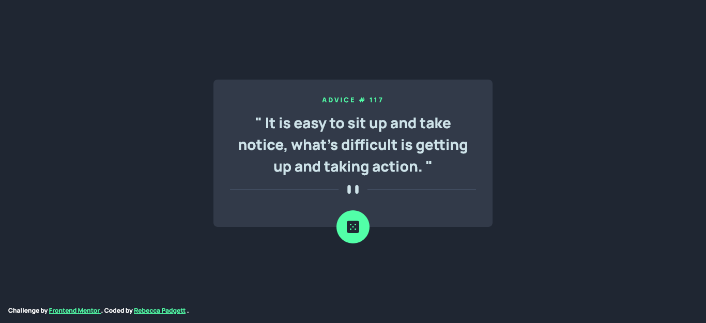

# Frontend Mentor - Advice generator app solution

This is a solution to the [Advice generator app challenge on Frontend Mentor](https://www.frontendmentor.io/challenges/advice-generator-app-QdUG-13db). Frontend Mentor challenges help you improve your coding skills by building realistic projects.

## Table of contents

- [Overview](#overview)
  - [The challenge](#the-challenge)
  - [Screenshot](#screenshot)
  - [Links](#links)
- [My process](#my-process)
  - [Built with](#built-with)
- [Author](#author)
- [Acknowledgments](#acknowledgments)

## Overview

### The challenge

Users should be able to:

- View the optimal layout for the app depending on their device's screen size
- See hover states for all interactive elements on the page
- Generate a new piece of advice by clicking the dice icon

### Screenshot

### Links

- Solution URL: [Frontend Mentor]()
- Live Site URL: [Github Pages]()

## My process

### Built with

### Useful resources

- [Fetch a non-cache-request](https://stackoverflow.com/questions/29246444/fetch-how-do-you-make-a-non-cached-request) - This StackOverflow article shows the different cache modes.
- [Referrer and cache control APIs for fetch()](https://hacks.mozilla.org/2016/03/referrer-and-cache-control-apis-for-fetch/) - More information on referrer and cach control for APIs
- [JavaScript - "use strict"](https://www.w3schools.com/js/js_strict.asp) - I applied "use strict" mode to catch errors in my JavaScript file.
- [HTML `<q>` Tag](https://www.w3schools.com/Tags/tag_q.asp) - W3schools article about the `<q>` tag
- [Quoting in HTML ](https://css-tricks.com/quoting-in-html-quotations-citations-and-blockquotes/) - The differences between the `<blockquote>`, `<q>`, and ` <cite>` HTML tags.

## Author

## Acknowledgments

[Advice generator app](https://www.youtube.com/watch?v=SjjmHNdE32Y) - This video explains how to use CSS Grid on the component container using shorthand CSS `<grid>` property to make two rows and a column.
